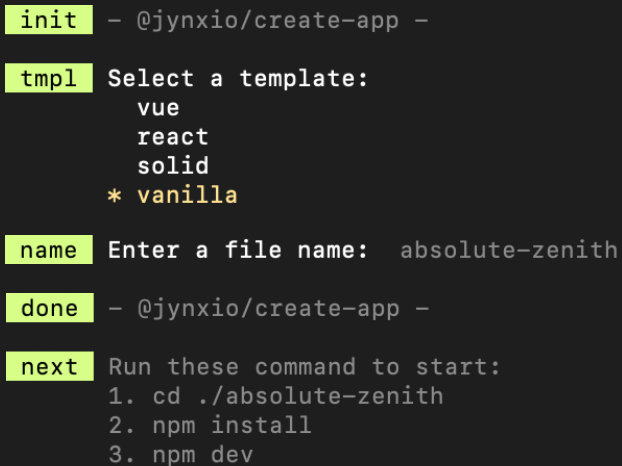

<h3 align="center">
  <code>npm create @jynxio/app</code>
</h3>

  <samp>Then create a project template in the CLI</samp>

<h2 align="center"><samp>Why?</samp></h2>

  <samp>Because I'm tired of repeatedly configuring ESLint, Stylelint, Prettier, TypeScript, and other scaffolding tools for new projects.</samp>

  

